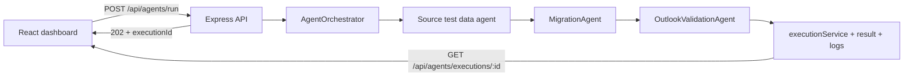

# Migration QA Agent System — Architecture

This document describes how the **Gmail → Outlook migration QA** stack in this repository works end-to-end. It is **not** the same as CloudFuze **Java/Mongo migration report CSV** validation (see `.cursor/skills/email-migration-reporting-agent/` for report QA).

## High-level flow



1. The UI starts a run; the API returns **202** and an **`executionId`** so the client can poll while long steps run in the background.
2. **`AgentOrchestrator.runFullFlow`** runs **three agents in sequence** (see below).
3. **State** (status, current agent, progress, final result) is stored via **`executionService`**; optional per-run log files under `backend/logs/`.

## Agents (orchestrator order)

| Order | Agent | Responsibility |
|------:|--------|------------------|
| 1 | **`GmailTestDataAgent`** (default) or **`OutlookTestDataAgent`** if `sourceProvider === 'microsoft'` | Seed mail, labels, drafts; optional calendar for E2E. Mail cases load from `backend/data/gmail-test-cases.xlsx` when present, else built-in definitions in code. |
| 2 | **`MigrationAgent`** | Talks to the external migration API (CloudFuze-style): login, validate user, trigger job, poll until terminal state. |
| 3 | **`OutlookValidationAgent`** | Validates destination via **Microsoft Graph** (counts, folders; optional deep mail pairing/compare when enabled). |

## Core types and configuration

- **`MigrationContext`** (`backend/src/models/MigrationContext.js`) — Carries `sourceEmail`, `destinationEmail`, `migrationType` (`FULL` \| `DELTA`), `includeMail`, `includeCalendar`, `testType` (`SMOKE` \| `SANITY` \| `E2E`), providers, **`deepValidation`**, and **`userEmailMappings`** for To/Cc/Bcc expectations.

## Key HTTP surface

| Endpoint | Role |
|----------|------|
| `POST /api/agents/run` | Start full QA flow (single pair or bulk `mappedPairs`). |
| `GET /api/agents/executions`, `GET /api/agents/executions/:id`, `GET /api/agents/executions/:id/logs` | List runs, poll status, read logs. |
| `GET /api/health`, `GET /api/agents/stats` | Health and aggregate stats. |

Paths are under `/api` as mounted by `backend/src/server.js` (see `agentRoutes`).

## Tech stack (short)

- **Backend:** Node.js, Express, Winston. **Clients:** Gmail API, Google Calendar API, Microsoft Graph. **Migration:** configured HTTP API (`MIGRATION_API_URL`, etc. in `.env`).
- **Frontend:** React (Vite), Tailwind, React Router; API via `frontend/src/services/api.js`.

## Optional behaviors

- **Scheduled runs:** `backend/src/config/scheduler.js` when `SCHEDULER_ENABLED` is set.
- **Test data only:** Separate controller flow to seed source mailboxes without running migration + validation (see `agentController` / routes).
- **Deep mail validation:** Comparator and Outlook agent wiring; can be toggled via context or environment (see `MigrationContext` and `ENABLE_DEEP_MAIL_VALIDATION`).

## Repository map

```
backend/src/
  orchestrator/AgentOrchestrator.js   # Sequential runner
  agents/gmail/GmailTestDataAgent.js
  agents/outlook/OutlookTestDataAgent.js
  agents/migration/MigrationAgent.js
  agents/outlook/OutlookValidationAgent.js
  controllers/agentController.js
  services/executionService.js
frontend/src/                         # Dashboard, forms, execution hooks
```

For setup and env vars, see **`README.md`** and **`.env.example` at the repo root**.
